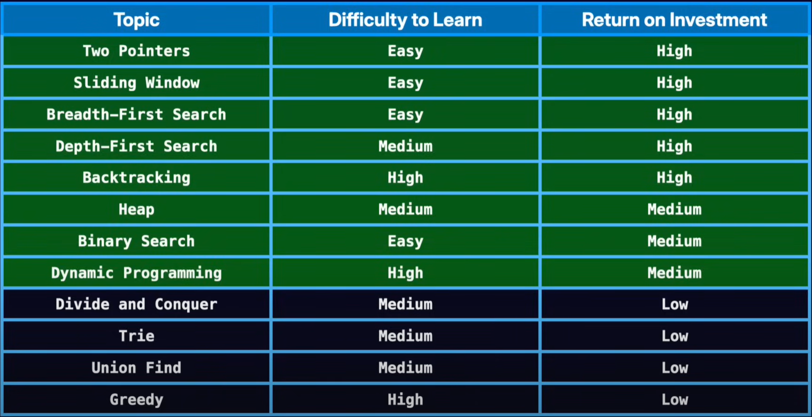

# Data Structures and Algorithms
Various algorithms and GFG, Leetcode problems are implemented in Java.

- Arrays
- String
- Sliding Window : [Playlist](https://www.youtube.com/playlist?list=PLgUwDviBIf0q7vrFA_HEWcqRqMpCXzYAL)
- Bit Manipulation: [Reference](https://takeuforward.org/blogs/bit-manipulation?page=1)
